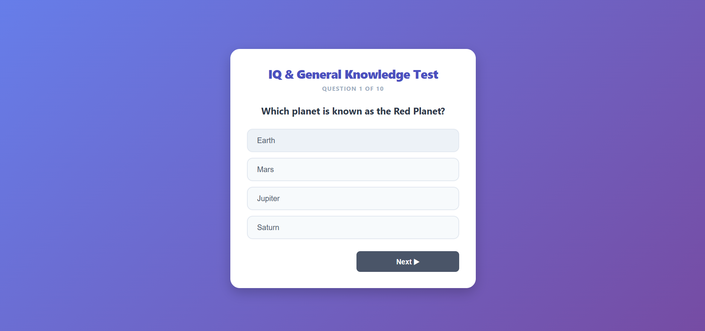

# 🧠 Quiz Score Tracker

> 🚀 **My First JavaScript Project**
> An interactive quiz application built using **HTML**, **CSS**, and **JavaScript**.

---

## 📖 About the Project

**Quiz Score Tracker** is a responsive web application that allows users to test their General Knowledge through an interactive multiple-choice quiz.

This project marks the beginning of my JavaScript learning journey. It was created to practice front-end web development by building a complete and interactive application from scratch.

The application offers a smooth quiz experience with easy navigation, real-time progress tracking, automatic score calculation, and the ability to restart the quiz after completion.

---

## ✨ Features

* 🧠 Interactive General Knowledge Quiz
* 📊 Progress Tracker
* ✅ Multiple Choice Questions
* ⬅️ Previous & Next Navigation
* 🎯 Answer Selection Highlight
* 🏆 Automatic Score Calculation
* 🔄 Restart Quiz
* 💻 Responsive Design
* 🎨 Clean & Modern User Interface
* ⚡ Fast and Lightweight

---

## 🛠️ Technologies Used

* HTML5
* CSS3
* JavaScript

---

## 📂 Project Structure

Quiz-Score-Tracker/
│── README.md
│── index.html
│── screenshot.png
│── script.js
│── style.css

---

## 📸 Project Preview



---

## 🚀 Live Demo

👉 **https://akshatraj2811.github.io/Quiz-Score-Tracker/**

---

## 🚀 Getting Started

### Clone the Repository

```bash
git clone https://github.com/akshatraj2811/Quiz-Score-Tracker.git
```

### Run the Project

1. Download or clone the repository.
2. Open the project folder.
3. Double-click **index.html** or open it in your preferred web browser.

No installation or additional software is required.

---

## 🎮 How to Use

1. Open the application.
2. Read each question carefully.
3. Select the correct answer.
4. Navigate using the **Previous** and **Next** buttons.
5. Submit the quiz after answering all questions.
6. View your final score.
7. Click **Play Again** to restart the quiz.

---

## 📚 What I Learned

Working on this project helped me improve my understanding of:

* HTML Structure
* CSS Styling
* Responsive Web Design
* JavaScript Basics
* Variables
* Arrays
* Functions
* Loops
* Conditional Statements
* Building Interactive Web Applications

---

## 🎯 Future Improvements

* ⏱️ Quiz Timer
* 🌙 Dark Mode
* 🎵 Sound Effects
* 📱 Better Mobile Experience
* 💾 Save High Scores
* 🎲 Random Questions
* 📚 Multiple Quiz Categories
* 🏅 Leaderboard
* 📈 Performance Statistics

---

## 🤝 Contributing

Suggestions and improvements are always welcome.

Feel free to fork this repository and submit a Pull Request.

---

## ⭐ Support

If you like this project, please consider giving it a **⭐ Star** on GitHub.

Your support motivates me to continue learning and building more exciting projects.

---

## 👨‍💻 Author

**Akshat Raj**

GitHub: https://github.com/akshatraj2811

---

### 🌟 Thank You for Visiting!

> *"Every project is a new opportunity to learn, improve, and grow as a developer. Thank you for checking out my first JavaScript project!"* 🚀
